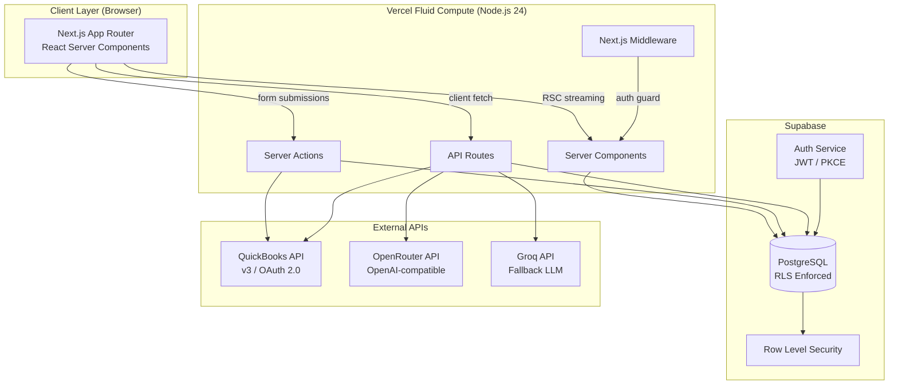
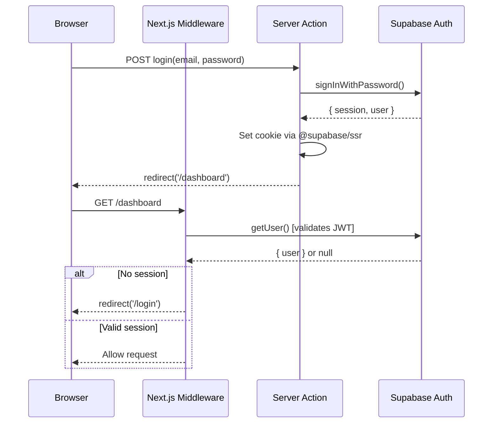
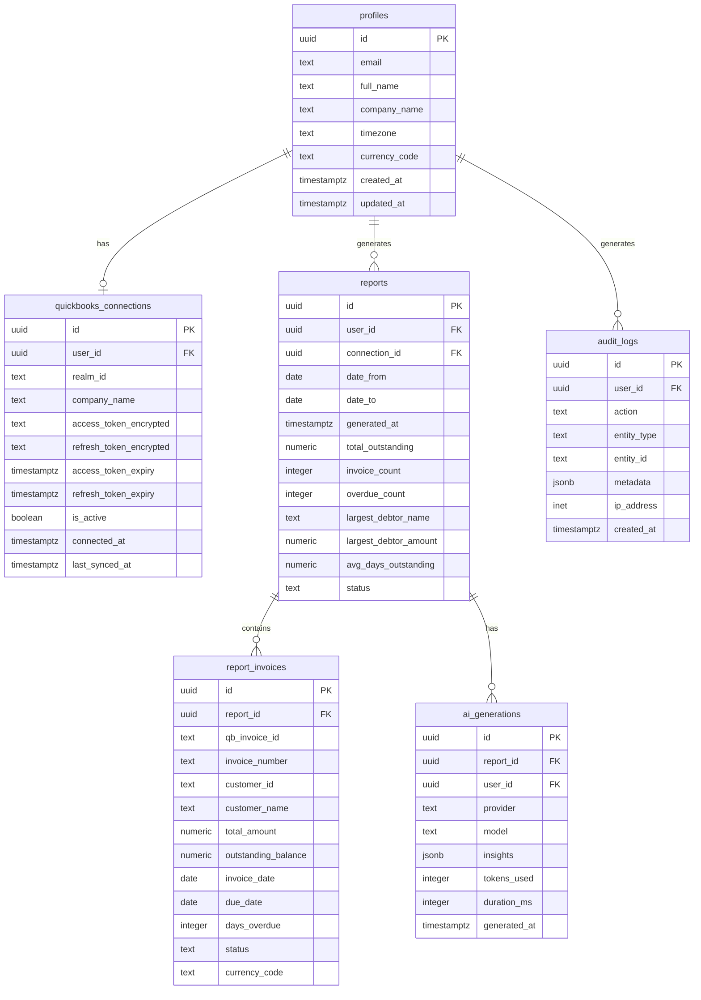
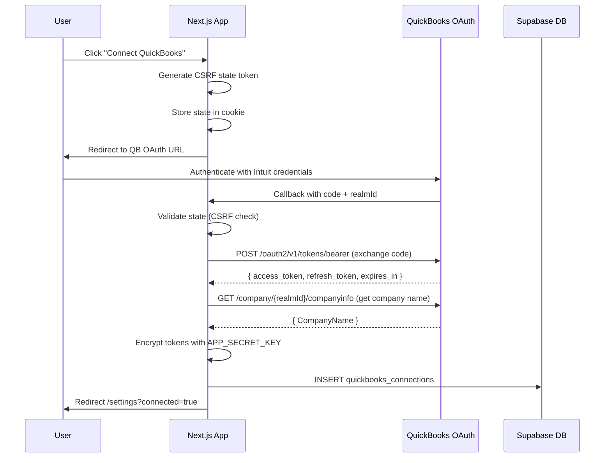
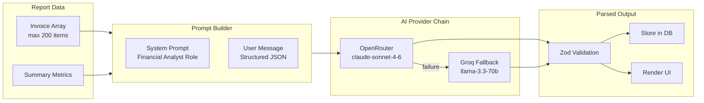
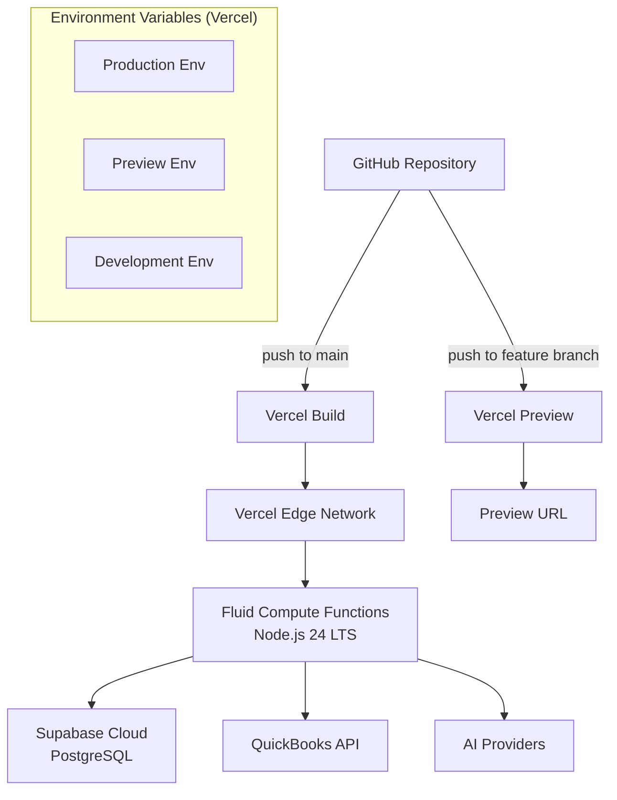

# System Architecture & Development Plan
# QuickBooks AI Outstanding Invoice Analyzer

**Version:** 1.0 | **Date:** 2026-06-14 | **Status:** Ready for Engineering

---

## Section 1 — High Level Architecture

### 1.1 System Overview



### 1.2 Frontend Architecture

**Rendering Strategy per page:**

| Page | Strategy | Reason |
|------|----------|--------|
| Landing `/` | Static (SSG) | No auth, SEO needed |
| Login / Register | Static | No data fetch |
| Dashboard `/dashboard` | Dynamic RSC | User-specific data |
| Reports `/reports` | Dynamic RSC + Client | Table interactivity |
| AI Insights `/ai-insights` | Client component | Streaming AI response |
| Settings `/settings` | Dynamic RSC | User connection state |

**Client-side state:** Minimal. Only table filters, sort state, and AI streaming state are client state. All other data flows through RSC props and Server Actions.

**Data flow pattern:**
```
URL Change → Middleware auth check → RSC fetches from Supabase
→ Props passed to Client Components → User action → Server Action
→ Supabase mutation → router.refresh() → RSC re-renders
```

### 1.3 Backend Architecture

All compute runs in **Next.js API Routes** and **Server Actions** on Vercel Fluid Compute:

- **Server Actions** — mutations (connect QB, save report, update profile)
- **API Routes** — data-intensive operations (QB fetch, AI call, file streaming)
- **Middleware** — auth session validation on every protected route

**API Route responsibilities matrix:**

| Route | Responsibility | Compute Profile |
|-------|---------------|-----------------|
| `/api/quickbooks/*` | OAuth + QB API proxy | Network-bound, 2–8s |
| `/api/reports/generate` | Fetch + normalize + persist | CPU + Network, 5–10s |
| `/api/ai/analyze` | Prompt build + LLM call | Network-bound, 10–20s |
| `/api/export/excel` | In-memory file build | CPU-bound, 1–3s |
| `/api/export/pdf` | In-memory file build | CPU-bound, 2–4s |

### 1.4 Authentication Architecture



**Token storage:** `@supabase/ssr` stores session in **HttpOnly cookies** — not localStorage. This prevents XSS token theft.

**Session refresh:** Supabase SSR package auto-refreshes the JWT on every request via middleware. No manual refresh needed.

### 1.5 Database Architecture



### 1.6 QuickBooks Integration Architecture



### 1.7 AI Integration Architecture



### 1.8 Export Architecture

Both exports are generated **server-side** in API Routes and streamed as binary responses. No temporary files on disk — everything in memory.

```
Client: GET /api/export/excel?reportId=uuid
Server:
  1. Auth check
  2. Fetch report + invoices from Supabase (RLS enforced)
  3. Build workbook in memory (ExcelJS)
  4. Set response headers (Content-Disposition, Content-Type)
  5. Pipe buffer to response
Client: Browser triggers download
```

### 1.9 Deployment Architecture



---

## Section 2 — Repository Structure

```
quickbooks-analyzer/
│
├── src/
│   ├── app/                          # Next.js App Router
│   │   ├── (auth)/                   # Route group — no layout chrome
│   │   │   ├── login/
│   │   │   │   └── page.tsx
│   │   │   ├── register/
│   │   │   │   └── page.tsx
│   │   │   ├── reset-password/
│   │   │   │   └── page.tsx
│   │   │   └── layout.tsx            # Centered card layout for auth pages
│   │   │
│   │   ├── (dashboard)/              # Route group — sidebar layout
│   │   │   ├── dashboard/
│   │   │   │   └── page.tsx          # KPI cards + quick actions
│   │   │   ├── reports/
│   │   │   │   └── page.tsx          # Date picker + invoice table
│   │   │   ├── ai-insights/
│   │   │   │   └── page.tsx          # AI analysis sections
│   │   │   ├── settings/
│   │   │   │   └── page.tsx          # Profile + QB connection
│   │   │   └── layout.tsx            # Sidebar + header layout
│   │   │
│   │   ├── api/                      # API Routes
│   │   │   ├── auth/
│   │   │   │   └── callback/
│   │   │   │       └── route.ts      # Supabase Auth callback
│   │   │   ├── quickbooks/
│   │   │   │   ├── connect/
│   │   │   │   │   └── route.ts      # Initiate OAuth
│   │   │   │   ├── callback/
│   │   │   │   │   └── route.ts      # Handle OAuth callback
│   │   │   │   ├── disconnect/
│   │   │   │   │   └── route.ts      # Revoke + delete tokens
│   │   │   │   └── invoices/
│   │   │   │       └── route.ts      # Fetch invoices from QB
│   │   │   ├── reports/
│   │   │   │   ├── generate/
│   │   │   │   │   └── route.ts      # Create + persist report
│   │   │   │   ├── history/
│   │   │   │   │   └── route.ts      # List user's reports
│   │   │   │   └── [id]/
│   │   │   │       └── route.ts      # Get single report
│   │   │   ├── ai/
│   │   │   │   └── analyze/
│   │   │   │       └── route.ts      # AI insights generation
│   │   │   └── export/
│   │   │       ├── excel/
│   │   │       │   └── route.ts      # Stream Excel file
│   │   │       └── pdf/
│   │   │           └── route.ts      # Stream PDF file
│   │   │
│   │   ├── layout.tsx                # Root layout (fonts, providers)
│   │   ├── page.tsx                  # Landing page
│   │   ├── not-found.tsx
│   │   └── error.tsx
│   │
│   ├── components/                   # Shared UI components
│   │   ├── ui/                       # shadcn/ui primitives (auto-generated)
│   │   │   ├── button.tsx
│   │   │   ├── card.tsx
│   │   │   ├── input.tsx
│   │   │   ├── badge.tsx
│   │   │   ├── table.tsx
│   │   │   ├── dialog.tsx
│   │   │   ├── select.tsx
│   │   │   ├── skeleton.tsx
│   │   │   ├── toast.tsx
│   │   │   ├── calendar.tsx
│   │   │   ├── popover.tsx
│   │   │   └── ...
│   │   │
│   │   ├── layout/                   # App layout components
│   │   │   ├── Sidebar.tsx
│   │   │   ├── Header.tsx
│   │   │   ├── MobileNav.tsx
│   │   │   └── UserMenu.tsx
│   │   │
│   │   ├── dashboard/                # Dashboard-specific components
│   │   │   ├── KPICard.tsx
│   │   │   ├── MetricsGrid.tsx
│   │   │   ├── ConnectionBanner.tsx
│   │   │   ├── QuickActions.tsx
│   │   │   └── EmptyDashboard.tsx
│   │   │
│   │   ├── reports/                  # Report page components
│   │   │   ├── DateRangePicker.tsx
│   │   │   ├── InvoiceTable.tsx
│   │   │   ├── InvoiceTableRow.tsx
│   │   │   ├── StatusBadge.tsx
│   │   │   ├── ReportControls.tsx
│   │   │   ├── ReportHistory.tsx
│   │   │   ├── TableFilters.tsx
│   │   │   ├── TablePagination.tsx
│   │   │   └── EmptyReport.tsx
│   │   │
│   │   ├── ai/                       # AI Insights components
│   │   │   ├── InsightsPanel.tsx
│   │   │   ├── ExecutiveSummary.tsx
│   │   │   ├── RiskCustomers.tsx
│   │   │   ├── OverdueAnalysis.tsx
│   │   │   ├── CollectionPriorities.tsx
│   │   │   ├── CashFlowOutlook.tsx
│   │   │   ├── InsightsLoading.tsx
│   │   │   └── InsightsEmpty.tsx
│   │   │
│   │   ├── settings/                 # Settings page components
│   │   │   ├── ProfileForm.tsx
│   │   │   ├── QBConnectionCard.tsx
│   │   │   ├── DangerZone.tsx
│   │   │   └── PasswordForm.tsx
│   │   │
│   │   └── shared/                   # Cross-feature shared components
│   │       ├── PageHeader.tsx
│   │       ├── ErrorMessage.tsx
│   │       ├── LoadingSkeleton.tsx
│   │       └── ConfirmDialog.tsx
│   │
│   ├── features/                     # Feature-level business logic (co-located)
│   │   ├── auth/
│   │   │   ├── schemas.ts            # Zod: LoginSchema, RegisterSchema
│   │   │   └── utils.ts              # Auth helpers
│   │   ├── quickbooks/
│   │   │   ├── schemas.ts            # Zod: QB API response schemas
│   │   │   ├── normalizer.ts         # QB Invoice → internal Invoice
│   │   │   └── calculations.ts       # daysOverdue, status derivation
│   │   ├── reports/
│   │   │   ├── schemas.ts            # Zod: Report request/response schemas
│   │   │   ├── metrics.ts            # Summary metric calculations
│   │   │   └── transformer.ts        # DB row → display model
│   │   ├── ai/
│   │   │   ├── prompts.ts            # System + user prompt builders
│   │   │   ├── schemas.ts            # Zod: AI response schema
│   │   │   └── formatter.ts          # Format AI output for display
│   │   └── export/
│   │       ├── excel.ts              # ExcelJS workbook builder
│   │       └── pdf.ts                # pdf-lib document builder
│   │
│   ├── services/                     # External service clients
│   │   ├── quickbooks/
│   │   │   ├── client.ts             # QB HTTP client (fetch wrapper)
│   │   │   ├── auth.ts               # OAuth token exchange + refresh
│   │   │   ├── invoices.ts           # getInvoices(), getInvoiceById()
│   │   │   └── company.ts            # getCompanyInfo()
│   │   ├── ai/
│   │   │   ├── client.ts             # OpenAI-compatible client
│   │   │   └── providers.ts          # OpenRouter + Groq config
│   │   └── supabase/
│   │       ├── client.ts             # Browser Supabase client
│   │       ├── server.ts             # Server Supabase client (cookies)
│   │       └── middleware.ts         # Supabase session refresh helper
│   │
│   ├── hooks/                        # React custom hooks (client-side)
│   │   ├── useReport.ts              # Report fetch + state
│   │   ├── useInvoiceFilters.ts      # Table filter/sort state
│   │   ├── useAIInsights.ts          # AI generation + polling
│   │   └── useQBConnection.ts        # Connection status
│   │
│   ├── actions/                      # Next.js Server Actions
│   │   ├── auth.ts                   # login, register, logout, resetPassword
│   │   ├── quickbooks.ts             # connectQB, disconnectQB
│   │   ├── reports.ts                # generateReport, deleteReport
│   │   ├── profile.ts                # updateProfile, deleteAccount
│   │   └── audit.ts                  # logAuditEvent (internal)
│   │
│   ├── lib/                          # Pure utilities (no side effects)
│   │   ├── encryption.ts             # encrypt / decrypt token strings
│   │   ├── currency.ts               # formatCurrency(amount, code)
│   │   ├── dates.ts                  # formatDate, daysBetween, isOverdue
│   │   ├── cn.ts                     # clsx + tailwind-merge helper
│   │   └── errors.ts                 # AppError class + error codes
│   │
│   ├── types/                        # TypeScript type definitions
│   │   ├── database.ts               # Supabase generated types (auto)
│   │   ├── invoice.ts                # Invoice, InvoiceStatus, AgingBucket
│   │   ├── report.ts                 # Report, ReportSummary, ReportStatus
│   │   ├── quickbooks.ts             # QB API response shapes
│   │   ├── ai.ts                     # AIInsights, AISection types
│   │   └── auth.ts                   # User, Profile types
│   │
│   └── middleware.ts                 # Next.js root middleware
│
├── supabase/
│   ├── migrations/
│   │   ├── 001_create_profiles.sql
│   │   ├── 002_create_quickbooks_connections.sql
│   │   ├── 003_create_reports.sql
│   │   ├── 004_create_report_invoices.sql
│   │   ├── 005_create_ai_generations.sql
│   │   ├── 006_create_audit_logs.sql
│   │   ├── 007_rls_policies.sql
│   │   └── 008_functions_triggers.sql
│   └── seed.sql                      # Dev seed data
│
├── public/
│   ├── logo.svg
│   ├── og-image.png
│   └── favicon.ico
│
├── .env.local                        # Local dev secrets (git-ignored)
├── .env.example                      # Template with var names only
├── next.config.ts
├── tailwind.config.ts
├── tsconfig.json
├── components.json                   # shadcn/ui config
├── package.json
└── README.md
```

**Folder purpose summary:**

| Folder | Purpose |
|--------|---------|
| `app/` | Next.js routing, pages, API routes |
| `components/` | Presentational React components, organized by domain |
| `features/` | Business logic co-located with its domain (schemas, normalizers, calculators) |
| `services/` | External API clients — QB, AI, Supabase |
| `hooks/` | Client-side React hooks for interactive state |
| `actions/` | Server Actions for form mutations |
| `lib/` | Pure utility functions with no external dependencies |
| `types/` | TypeScript type definitions only — no logic |
| `supabase/` | SQL migration files, managed by Supabase CLI |

---

## Section 3 — Database Implementation

### 3.1 Enable Required Extensions

```sql
-- Run once on Supabase project
CREATE EXTENSION IF NOT EXISTS "pgcrypto";
CREATE EXTENSION IF NOT EXISTS "uuid-ossp";
```

### 3.2 Migration 001 — profiles

```sql
CREATE TABLE profiles (
  id            UUID PRIMARY KEY REFERENCES auth.users(id) ON DELETE CASCADE,
  email         TEXT NOT NULL UNIQUE,
  full_name     TEXT,
  company_name  TEXT,
  timezone      TEXT NOT NULL DEFAULT 'UTC',
  currency_code TEXT NOT NULL DEFAULT 'USD',
  created_at    TIMESTAMPTZ NOT NULL DEFAULT now(),
  updated_at    TIMESTAMPTZ NOT NULL DEFAULT now()
);

CREATE INDEX idx_profiles_email ON profiles(email);

-- Auto-update updated_at
CREATE OR REPLACE FUNCTION update_updated_at_column()
RETURNS TRIGGER AS $$
BEGIN
  NEW.updated_at = now();
  RETURN NEW;
END;
$$ LANGUAGE plpgsql;

CREATE TRIGGER profiles_updated_at
  BEFORE UPDATE ON profiles
  FOR EACH ROW EXECUTE FUNCTION update_updated_at_column();

-- Auto-create profile on auth.users insert
CREATE OR REPLACE FUNCTION handle_new_user()
RETURNS TRIGGER AS $$
BEGIN
  INSERT INTO profiles (id, email, full_name)
  VALUES (
    NEW.id,
    NEW.email,
    COALESCE(NEW.raw_user_meta_data->>'full_name', '')
  );
  RETURN NEW;
END;
$$ LANGUAGE plpgsql SECURITY DEFINER;

CREATE TRIGGER on_auth_user_created
  AFTER INSERT ON auth.users
  FOR EACH ROW EXECUTE FUNCTION handle_new_user();
```

### 3.3 Migration 002 — quickbooks_connections

```sql
CREATE TABLE quickbooks_connections (
  id                    UUID PRIMARY KEY DEFAULT gen_random_uuid(),
  user_id               UUID NOT NULL REFERENCES profiles(id) ON DELETE CASCADE,
  realm_id              TEXT NOT NULL,
  company_name          TEXT NOT NULL,
  -- Tokens stored encrypted via pgp_sym_encrypt
  access_token          TEXT NOT NULL,
  refresh_token         TEXT NOT NULL,
  access_token_expiry   TIMESTAMPTZ NOT NULL,
  refresh_token_expiry  TIMESTAMPTZ NOT NULL,
  is_active             BOOLEAN NOT NULL DEFAULT true,
  connected_at          TIMESTAMPTZ NOT NULL DEFAULT now(),
  last_synced_at        TIMESTAMPTZ,
  disconnected_at       TIMESTAMPTZ,

  CONSTRAINT uq_user_realm UNIQUE (user_id, realm_id)
);

CREATE INDEX idx_qb_conn_user_id    ON quickbooks_connections(user_id);
CREATE INDEX idx_qb_conn_active     ON quickbooks_connections(user_id, is_active);
CREATE INDEX idx_qb_conn_realm      ON quickbooks_connections(realm_id);
```

### 3.4 Migration 003 — reports

```sql
CREATE TABLE reports (
  id                    UUID PRIMARY KEY DEFAULT gen_random_uuid(),
  user_id               UUID NOT NULL REFERENCES profiles(id) ON DELETE CASCADE,
  connection_id         UUID REFERENCES quickbooks_connections(id) ON DELETE SET NULL,
  date_from             DATE NOT NULL,
  date_to               DATE NOT NULL,
  generated_at          TIMESTAMPTZ NOT NULL DEFAULT now(),

  -- Cached aggregate metrics
  total_outstanding     NUMERIC(15,2),
  invoice_count         INTEGER,
  overdue_count         INTEGER,
  largest_debtor_name   TEXT,
  largest_debtor_amount NUMERIC(15,2),
  avg_days_outstanding  NUMERIC(8,2),

  -- Generation status
  status                TEXT NOT NULL DEFAULT 'generating'
                        CHECK (status IN ('generating','completed','failed')),
  error_message         TEXT
);

CREATE INDEX idx_reports_user_id         ON reports(user_id);
CREATE INDEX idx_reports_user_generated  ON reports(user_id, generated_at DESC);
CREATE INDEX idx_reports_status          ON reports(status);
```

### 3.5 Migration 004 — report_invoices

```sql
CREATE TABLE report_invoices (
  id                  UUID PRIMARY KEY DEFAULT gen_random_uuid(),
  report_id           UUID NOT NULL REFERENCES reports(id) ON DELETE CASCADE,

  qb_invoice_id       TEXT NOT NULL,
  invoice_number      TEXT NOT NULL,
  customer_id         TEXT NOT NULL,
  customer_name       TEXT NOT NULL,

  total_amount        NUMERIC(15,2) NOT NULL,
  outstanding_balance NUMERIC(15,2) NOT NULL,

  invoice_date        DATE NOT NULL,
  due_date            DATE,

  -- Calculated at report generation time
  days_overdue        INTEGER DEFAULT 0,
  status              TEXT NOT NULL
                      CHECK (status IN ('current','due_today','overdue','paid')),

  currency_code       TEXT NOT NULL DEFAULT 'USD'
);

CREATE INDEX idx_ri_report_id   ON report_invoices(report_id);
CREATE INDEX idx_ri_customer    ON report_invoices(report_id, customer_name);
CREATE INDEX idx_ri_status      ON report_invoices(report_id, status);
CREATE INDEX idx_ri_overdue     ON report_invoices(report_id, days_overdue DESC);
```

### 3.6 Migration 005 — ai_generations

```sql
CREATE TABLE ai_generations (
  id            UUID PRIMARY KEY DEFAULT gen_random_uuid(),
  report_id     UUID NOT NULL REFERENCES reports(id) ON DELETE CASCADE,
  user_id       UUID NOT NULL REFERENCES profiles(id) ON DELETE CASCADE,

  provider      TEXT NOT NULL,         -- 'openrouter' | 'groq'
  model         TEXT NOT NULL,         -- exact model string used
  insights      JSONB NOT NULL,        -- parsed AI response
  prompt_tokens INTEGER,
  completion_tokens INTEGER,
  duration_ms   INTEGER,

  generated_at  TIMESTAMPTZ NOT NULL DEFAULT now()
);

CREATE INDEX idx_ai_gen_report_id ON ai_generations(report_id);
CREATE INDEX idx_ai_gen_user_id   ON ai_generations(user_id, generated_at DESC);
```

### 3.7 Migration 006 — audit_logs

```sql
CREATE TABLE audit_logs (
  id          UUID PRIMARY KEY DEFAULT gen_random_uuid(),
  user_id     UUID REFERENCES profiles(id) ON DELETE SET NULL,
  action      TEXT NOT NULL,
  entity_type TEXT,
  entity_id   TEXT,
  metadata    JSONB,
  ip_address  INET,
  user_agent  TEXT,
  created_at  TIMESTAMPTZ NOT NULL DEFAULT now()
);

CREATE INDEX idx_audit_user_id ON audit_logs(user_id, created_at DESC);
CREATE INDEX idx_audit_action  ON audit_logs(action, created_at DESC);

-- Partition hint for future: created_at monthly
```

**Valid `action` values:**
```
user.registered   user.login        user.logout
user.deleted      password.reset
qb.connected      qb.disconnected   qb.token_refreshed  qb.token_expired
report.generated  report.deleted
export.excel      export.pdf
ai.analyzed       ai.failed
```

### 3.8 Migration 007 — RLS Policies

```sql
-- Enable RLS
ALTER TABLE profiles             ENABLE ROW LEVEL SECURITY;
ALTER TABLE quickbooks_connections ENABLE ROW LEVEL SECURITY;
ALTER TABLE reports              ENABLE ROW LEVEL SECURITY;
ALTER TABLE report_invoices      ENABLE ROW LEVEL SECURITY;
ALTER TABLE ai_generations       ENABLE ROW LEVEL SECURITY;
ALTER TABLE audit_logs           ENABLE ROW LEVEL SECURITY;

-- profiles
CREATE POLICY "profiles_select_own" ON profiles
  FOR SELECT USING (auth.uid() = id);
CREATE POLICY "profiles_update_own" ON profiles
  FOR UPDATE USING (auth.uid() = id);

-- quickbooks_connections
CREATE POLICY "qb_all_own" ON quickbooks_connections
  FOR ALL USING (auth.uid() = user_id);

-- reports
CREATE POLICY "reports_all_own" ON reports
  FOR ALL USING (auth.uid() = user_id);

-- report_invoices (via report ownership)
CREATE POLICY "report_invoices_select_own" ON report_invoices
  FOR SELECT USING (
    EXISTS (
      SELECT 1 FROM reports r
      WHERE r.id = report_invoices.report_id
        AND r.user_id = auth.uid()
    )
  );
CREATE POLICY "report_invoices_insert_own" ON report_invoices
  FOR INSERT WITH CHECK (
    EXISTS (
      SELECT 1 FROM reports r
      WHERE r.id = report_invoices.report_id
        AND r.user_id = auth.uid()
    )
  );
CREATE POLICY "report_invoices_delete_own" ON report_invoices
  FOR DELETE USING (
    EXISTS (
      SELECT 1 FROM reports r
      WHERE r.id = report_invoices.report_id
        AND r.user_id = auth.uid()
    )
  );

-- ai_generations
CREATE POLICY "ai_gen_all_own" ON ai_generations
  FOR ALL USING (auth.uid() = user_id);

-- audit_logs (insert-only via service role; select own)
CREATE POLICY "audit_select_own" ON audit_logs
  FOR SELECT USING (auth.uid() = user_id);
```

---

## Section 4 — Supabase Implementation

### 4.1 Client Architecture

Two distinct clients, never mixed:

**Browser client** (`src/services/supabase/client.ts`):
```typescript
import { createBrowserClient } from '@supabase/ssr'
import type { Database } from '@/types/database'

export function createClient() {
  return createBrowserClient<Database>(
    process.env.NEXT_PUBLIC_SUPABASE_URL!,
    process.env.NEXT_PUBLIC_SUPABASE_ANON_KEY!
  )
}
```

**Server client** (`src/services/supabase/server.ts`):
```typescript
import { createServerClient } from '@supabase/ssr'
import { cookies } from 'next/headers'
import type { Database } from '@/types/database'

export async function createClient() {
  const cookieStore = await cookies()
  return createServerClient<Database>(
    process.env.NEXT_PUBLIC_SUPABASE_URL!,
    process.env.NEXT_PUBLIC_SUPABASE_ANON_KEY!,
    {
      cookies: {
        getAll() { return cookieStore.getAll() },
        setAll(cookiesToSet) {
          cookiesToSet.forEach(({ name, value, options }) =>
            cookieStore.set(name, value, options)
          )
        },
      },
    }
  )
}
```

**Service-role client** (used only in Server Actions / API Routes for admin ops like audit log inserts):
```typescript
import { createClient } from '@supabase/supabase-js'

export const supabaseAdmin = createClient(
  process.env.NEXT_PUBLIC_SUPABASE_URL!,
  process.env.SUPABASE_SERVICE_ROLE_KEY!,
  { auth: { autoRefreshToken: false, persistSession: false } }
)
```

### 4.2 Middleware

```typescript
// src/middleware.ts
import { createServerClient } from '@supabase/ssr'
import { NextResponse, type NextRequest } from 'next/server'

const PROTECTED_PATHS = ['/dashboard', '/reports', '/ai-insights', '/settings']
const AUTH_PATHS = ['/login', '/register', '/reset-password']

export async function middleware(request: NextRequest) {
  let response = NextResponse.next({ request })

  const supabase = createServerClient(
    process.env.NEXT_PUBLIC_SUPABASE_URL!,
    process.env.NEXT_PUBLIC_SUPABASE_ANON_KEY!,
    {
      cookies: {
        getAll() { return request.cookies.getAll() },
        setAll(cookiesToSet) {
          cookiesToSet.forEach(({ name, value, options }) => {
            request.cookies.set(name, value)
            response.cookies.set(name, value, options)
          })
        },
      },
    }
  )

  const { data: { user } } = await supabase.auth.getUser()
  const path = request.nextUrl.pathname

  const isProtected = PROTECTED_PATHS.some(p => path.startsWith(p))
  const isAuthPath  = AUTH_PATHS.some(p => path.startsWith(p))

  if (isProtected && !user) {
    return NextResponse.redirect(new URL('/login', request.url))
  }

  if (isAuthPath && user) {
    return NextResponse.redirect(new URL('/dashboard', request.url))
  }

  return response
}

export const config = {
  matcher: ['/((?!_next/static|_next/image|favicon.ico|api/auth).*)'],
}
```

### 4.3 Auth Flow — Server Actions

```typescript
// src/actions/auth.ts
'use server'
import { createClient } from '@/services/supabase/server'
import { redirect } from 'next/navigation'
import { LoginSchema, RegisterSchema } from '@/features/auth/schemas'

export async function login(formData: FormData) {
  const parsed = LoginSchema.safeParse(Object.fromEntries(formData))
  if (!parsed.success) return { error: 'Invalid input' }

  const supabase = await createClient()
  const { error } = await supabase.auth.signInWithPassword(parsed.data)
  if (error) return { error: 'Invalid email or password' }

  redirect('/dashboard')
}

export async function register(formData: FormData) {
  const parsed = RegisterSchema.safeParse(Object.fromEntries(formData))
  if (!parsed.success) return { error: parsed.error.flatten() }

  const supabase = await createClient()
  const { error } = await supabase.auth.signUp({
    email: parsed.data.email,
    password: parsed.data.password,
    options: { data: { full_name: parsed.data.fullName } }
  })
  if (error) return { error: error.message }

  redirect('/login?message=check-email')
}

export async function logout() {
  const supabase = await createClient()
  await supabase.auth.signOut()
  redirect('/login')
}
```

### 4.4 Environment Variables

```bash
# .env.local (never commit)
NEXT_PUBLIC_SUPABASE_URL=https://xxxx.supabase.co
NEXT_PUBLIC_SUPABASE_ANON_KEY=eyJ...
SUPABASE_SERVICE_ROLE_KEY=eyJ...     # Server-only, never expose to client

NEXT_PUBLIC_APP_URL=http://localhost:3000

QB_CLIENT_ID=
QB_CLIENT_SECRET=
QB_TOKEN_ENCRYPTION_KEY=             # openssl rand -hex 32

AI_PROVIDER=openrouter
AI_API_KEY=
AI_MODEL=anthropic/claude-sonnet-4-6
AI_FALLBACK_PROVIDER=groq
AI_FALLBACK_API_KEY=
AI_FALLBACK_MODEL=llama-3.3-70b-versatile
```

---

## Section 5 — QuickBooks Integration

### 5.1 Token Lifecycle

```
Access Token:  valid 60 minutes
Refresh Token: valid 100 days

Strategy:
- Store expiry timestamps alongside encrypted tokens
- Before every QB API call: check if access_token_expiry < now() + 5min
- If yes: call refreshToken() → update DB → use new token
- If refresh_token_expiry < now(): mark connection inactive, notify user
```

### 5.2 Encryption Implementation

```typescript
// src/lib/encryption.ts
import crypto from 'crypto'

const ALGORITHM = 'aes-256-gcm'
const KEY = Buffer.from(process.env.QB_TOKEN_ENCRYPTION_KEY!, 'hex') // 32 bytes

export function encrypt(plaintext: string): string {
  const iv = crypto.randomBytes(12)
  const cipher = crypto.createCipheriv(ALGORITHM, KEY, iv)
  const encrypted = Buffer.concat([
    cipher.update(plaintext, 'utf8'),
    cipher.final()
  ])
  const tag = cipher.getAuthTag()
  // Format: iv(12):tag(16):ciphertext — all base64
  return [
    iv.toString('base64'),
    tag.toString('base64'),
    encrypted.toString('base64')
  ].join(':')
}

export function decrypt(ciphertext: string): string {
  const [ivB64, tagB64, dataB64] = ciphertext.split(':')
  const iv  = Buffer.from(ivB64, 'base64')
  const tag = Buffer.from(tagB64, 'base64')
  const data = Buffer.from(dataB64, 'base64')
  const decipher = crypto.createDecipheriv(ALGORITHM, KEY, iv)
  decipher.setAuthTag(tag)
  return decipher.update(data) + decipher.final('utf8')
}
```

### 5.3 QuickBooks Service Layer

**`src/services/quickbooks/auth.ts`:**
```typescript
import { createClient } from '@/services/supabase/server'
import { encrypt, decrypt } from '@/lib/encryption'
import { AppError } from '@/lib/errors'

const QB_TOKEN_URL = 'https://oauth.platform.intuit.com/oauth2/v1/tokens/bearer'

export async function getActiveConnection(userId: string) {
  const supabase = await createClient()
  const { data, error } = await supabase
    .from('quickbooks_connections')
    .select('*')
    .eq('user_id', userId)
    .eq('is_active', true)
    .single()

  if (error || !data) throw new AppError('QB_NOT_CONNECTED', 'No active QuickBooks connection')
  return data
}

export async function getValidAccessToken(userId: string): Promise<string> {
  const conn = await getActiveConnection(userId)

  const expiresAt = new Date(conn.access_token_expiry)
  const needsRefresh = expiresAt.getTime() - Date.now() < 5 * 60 * 1000

  if (!needsRefresh) return decrypt(conn.access_token)

  return refreshAccessToken(userId, conn.id, decrypt(conn.refresh_token))
}

async function refreshAccessToken(
  userId: string,
  connectionId: string,
  refreshToken: string
): Promise<string> {
  const credentials = Buffer.from(
    `${process.env.QB_CLIENT_ID}:${process.env.QB_CLIENT_SECRET}`
  ).toString('base64')

  const response = await fetch(QB_TOKEN_URL, {
    method: 'POST',
    headers: {
      'Authorization': `Basic ${credentials}`,
      'Content-Type': 'application/x-www-form-urlencoded',
      'Accept': 'application/json',
    },
    body: new URLSearchParams({
      grant_type: 'refresh_token',
      refresh_token: refreshToken,
    }),
  })

  if (!response.ok) {
    // Mark connection as expired
    const supabase = await createClient()
    await supabase
      .from('quickbooks_connections')
      .update({ is_active: false, disconnected_at: new Date().toISOString() })
      .eq('id', connectionId)

    throw new AppError('QB_TOKEN_EXPIRED', 'QuickBooks session expired. Please reconnect.')
  }

  const tokens = await response.json()
  const newExpiry = new Date(Date.now() + tokens.expires_in * 1000)

  const supabase = await createClient()
  await supabase
    .from('quickbooks_connections')
    .update({
      access_token: encrypt(tokens.access_token),
      access_token_expiry: newExpiry.toISOString(),
      last_synced_at: new Date().toISOString(),
    })
    .eq('id', connectionId)

  return tokens.access_token
}
```

**`src/services/quickbooks/invoices.ts`:**
```typescript
import { getValidAccessToken, getActiveConnection } from './auth'
import type { QBInvoice } from '@/types/quickbooks'

const QB_BASE_URL = process.env.NODE_ENV === 'production'
  ? 'https://quickbooks.api.intuit.com/v3/company'
  : 'https://sandbox-quickbooks.api.intuit.com/v3/company'

export async function getOutstandingInvoices(
  userId: string,
  dateFrom: string,
  dateTo: string
): Promise<QBInvoice[]> {
  const [accessToken, connection] = await Promise.all([
    getValidAccessToken(userId),
    getActiveConnection(userId),
  ])

  const query = encodeURIComponent(
    `SELECT * FROM Invoice WHERE Balance > '0' ` +
    `AND TxnDate >= '${dateFrom}' AND TxnDate <= '${dateTo}' ` +
    `MAXRESULTS 1000`
  )

  const response = await fetch(
    `${QB_BASE_URL}/${connection.realm_id}/query?query=${query}&minorversion=65`,
    {
      headers: {
        'Authorization': `Bearer ${accessToken}`,
        'Accept': 'application/json',
      },
    }
  )

  if (!response.ok) {
    const err = await response.json()
    throw new Error(`QB API error: ${err.Fault?.Error?.[0]?.Message ?? response.statusText}`)
  }

  const data = await response.json()
  return data.QueryResponse?.Invoice ?? []
}
```

**`src/services/quickbooks/client.ts`** — OAuth initiation:
```typescript
export function buildAuthorizationUrl(state: string): string {
  const params = new URLSearchParams({
    client_id: process.env.QB_CLIENT_ID!,
    redirect_uri: `${process.env.NEXT_PUBLIC_APP_URL}/api/quickbooks/callback`,
    scope: 'com.intuit.quickbooks.accounting',
    response_type: 'code',
    state,
  })
  return `https://appcenter.intuit.com/connect/oauth2?${params}`
}

export async function exchangeCodeForTokens(code: string) {
  const credentials = Buffer.from(
    `${process.env.QB_CLIENT_ID}:${process.env.QB_CLIENT_SECRET}`
  ).toString('base64')

  const response = await fetch(
    'https://oauth.platform.intuit.com/oauth2/v1/tokens/bearer',
    {
      method: 'POST',
      headers: {
        'Authorization': `Basic ${credentials}`,
        'Content-Type': 'application/x-www-form-urlencoded',
      },
      body: new URLSearchParams({
        grant_type: 'authorization_code',
        code,
        redirect_uri: `${process.env.NEXT_PUBLIC_APP_URL}/api/quickbooks/callback`,
      }),
    }
  )

  if (!response.ok) throw new Error('Token exchange failed')
  return response.json()
}
```

### 5.4 Invoice Normalizer

```typescript
// src/features/quickbooks/normalizer.ts
import type { QBInvoice } from '@/types/quickbooks'
import type { Invoice } from '@/types/invoice'
import { calculateDaysOverdue, deriveStatus } from './calculations'

export function normalizeInvoice(qb: QBInvoice): Invoice {
  const dueDate = qb.DueDate ?? null
  const daysOverdue = dueDate ? calculateDaysOverdue(dueDate) : 0

  return {
    qbInvoiceId:        qb.Id,
    invoiceNumber:      qb.DocNumber,
    customerId:         qb.CustomerRef.value,
    customerName:       qb.CustomerRef.name,
    invoiceDate:        qb.TxnDate,
    dueDate:            dueDate,
    totalAmount:        parseFloat(qb.TotalAmt),
    outstandingBalance: parseFloat(qb.Balance),
    daysOverdue,
    status:             deriveStatus(parseFloat(qb.Balance), dueDate),
    currencyCode:       qb.CurrencyRef?.value ?? 'USD',
  }
}

// src/features/quickbooks/calculations.ts
import { differenceInCalendarDays, parseISO, isToday, isPast } from 'date-fns'

export function calculateDaysOverdue(dueDateStr: string): number {
  const dueDate = parseISO(dueDateStr)
  if (!isPast(dueDate) || isToday(dueDate)) return 0
  return differenceInCalendarDays(new Date(), dueDate)
}

export function deriveStatus(
  balance: number,
  dueDateStr: string | null
): 'current' | 'due_today' | 'overdue' | 'paid' {
  if (balance <= 0) return 'paid'
  if (!dueDateStr) return 'current'
  const dueDate = parseISO(dueDateStr)
  if (isToday(dueDate)) return 'due_today'
  if (isPast(dueDate)) return 'overdue'
  return 'current'
}
```

---

## Section 6 — Report Engine

### 6.1 Pipeline

```
POST /api/reports/generate
│
├─ 1. AUTH: Validate user session
├─ 2. VALIDATE: Zod parse { dateFrom, dateTo }
├─ 3. FETCH: getOutstandingInvoices(userId, dateFrom, dateTo)
│         └─ QB API query → raw QB Invoice[]
├─ 4. NORMALIZE: normalizeInvoice(qbInvoice) for each item
│         └─ Invoice[] with derived fields
├─ 5. CALCULATE METRICS: calculateSummaryMetrics(invoices)
│         ├─ totalOutstanding = sum(outstanding_balance)
│         ├─ invoiceCount = count
│         ├─ overdueCount = count where status === 'overdue'
│         ├─ largestDebtor = group by customer → max sum
│         └─ avgDaysOutstanding = mean(daysBetween(invoiceDate, today))
├─ 6. PERSIST REPORT: INSERT into reports (status='generating')
├─ 7. PERSIST INVOICES: INSERT INTO report_invoices (batch)
├─ 8. UPDATE REPORT: UPDATE reports SET status='completed', metrics...
├─ 9. AUDIT LOG: logAuditEvent('report.generated', reportId)
└─ 10. RETURN: { report, invoices }
```

### 6.2 Metrics Calculator

```typescript
// src/features/reports/metrics.ts
import type { Invoice } from '@/types/invoice'
import { differenceInCalendarDays, parseISO } from 'date-fns'

export function calculateSummaryMetrics(invoices: Invoice[]) {
  const outstanding = invoices.filter(i => i.status !== 'paid')

  const totalOutstanding = outstanding.reduce(
    (sum, i) => sum + i.outstandingBalance, 0
  )

  const overdueCount = outstanding.filter(i => i.status === 'overdue').length

  // Group by customer to find largest debtor
  const customerTotals = outstanding.reduce<Record<string, number>>((acc, inv) => {
    acc[inv.customerName] = (acc[inv.customerName] ?? 0) + inv.outstandingBalance
    return acc
  }, {})

  const [largestDebtorName, largestDebtorAmount] = Object.entries(customerTotals)
    .sort(([, a], [, b]) => b - a)[0] ?? ['—', 0]

  const avgDaysOutstanding = outstanding.length > 0
    ? outstanding.reduce((sum, i) => {
        return sum + differenceInCalendarDays(new Date(), parseISO(i.invoiceDate))
      }, 0) / outstanding.length
    : 0

  return {
    totalOutstanding: Math.round(totalOutstanding * 100) / 100,
    invoiceCount: outstanding.length,
    overdueCount,
    largestDebtorName,
    largestDebtorAmount: Math.round(largestDebtorAmount * 100) / 100,
    avgDaysOutstanding: Math.round(avgDaysOutstanding * 10) / 10,
  }
}
```

### 6.3 Report API Route

```typescript
// src/app/api/reports/generate/route.ts
import { NextRequest, NextResponse } from 'next/server'
import { createClient } from '@/services/supabase/server'
import { getOutstandingInvoices } from '@/services/quickbooks/invoices'
import { normalizeInvoice } from '@/features/quickbooks/normalizer'
import { calculateSummaryMetrics } from '@/features/reports/metrics'
import { GenerateReportSchema } from '@/features/reports/schemas'
import { logAuditEvent } from '@/actions/audit'

export async function POST(request: NextRequest) {
  const supabase = await createClient()
  const { data: { user } } = await supabase.auth.getUser()
  if (!user) return NextResponse.json({ error: 'Unauthorized' }, { status: 401 })

  const body = await request.json()
  const parsed = GenerateReportSchema.safeParse(body)
  if (!parsed.success) {
    return NextResponse.json({ error: parsed.error.flatten() }, { status: 400 })
  }

  const { dateFrom, dateTo } = parsed.data

  // Create placeholder report
  const { data: report } = await supabase
    .from('reports')
    .insert({ user_id: user.id, date_from: dateFrom, date_to: dateTo, status: 'generating' })
    .select()
    .single()

  try {
    const qbInvoices = await getOutstandingInvoices(user.id, dateFrom, dateTo)
    const invoices = qbInvoices.map(normalizeInvoice)
    const metrics = calculateSummaryMetrics(invoices)

    // Bulk insert invoices
    if (invoices.length > 0) {
      await supabase.from('report_invoices').insert(
        invoices.map(inv => ({ ...inv, report_id: report.id }))
      )
    }

    // Update report with metrics
    await supabase.from('reports').update({
      status: 'completed',
      ...metrics,
    }).eq('id', report.id)

    await logAuditEvent(user.id, 'report.generated', 'report', report.id)

    return NextResponse.json({ report: { ...report, ...metrics }, invoices })
  } catch (err: any) {
    await supabase.from('reports')
      .update({ status: 'failed', error_message: err.message })
      .eq('id', report.id)

    return NextResponse.json(
      { error: err.message, code: err.code ?? 'REPORT_FAILED' },
      { status: 500 }
    )
  }
}
```

---

## Section 7 — AI Architecture

### 7.1 Phase 1 — Simple Insights (MVP)

```typescript
// src/features/ai/prompts.ts

export const FINANCIAL_ANALYST_SYSTEM_PROMPT = `
You are a senior financial analyst specializing in accounts receivable management for small and medium businesses.

You will receive structured JSON data containing outstanding invoice information.
Analyze the data and produce a professional financial report.

RULES:
- Be specific: use exact customer names, invoice numbers, and dollar amounts from the data
- Round all currency values to 2 decimal places
- Use professional business language suitable for C-suite consumption
- Do not invent data not present in the input
- If data is limited, say so honestly

OUTPUT FORMAT: Respond with valid JSON only. No markdown, no prose outside the JSON structure.

Schema:
{
  "executiveSummary": "string (2-3 paragraphs)",
  "highRiskCustomers": [
    {
      "customerName": "string",
      "totalOwed": number,
      "longestOverdueDays": number,
      "invoiceCount": number,
      "riskLevel": "low" | "medium" | "high"
    }
  ],
  "overdueAnalysis": {
    "buckets": [
      { "label": "1-30 days", "count": number, "totalBalance": number },
      { "label": "31-60 days", "count": number, "totalBalance": number },
      { "label": "61-90 days", "count": number, "totalBalance": number },
      { "label": "90+ days", "count": number, "totalBalance": number }
    ],
    "commentary": "string"
  },
  "collectionPriorities": [
    {
      "rank": number,
      "customerName": "string",
      "invoiceNumber": "string",
      "amount": number,
      "daysOverdue": number,
      "recommendation": "string"
    }
  ],
  "cashFlowOutlook": {
    "expectedNext30Days": number,
    "atRiskAmount": number,
    "commentary": "string"
  }
}
`.trim()

export function buildUserMessage(data: {
  dateFrom: string
  dateTo: string
  summary: object
  invoices: object[]
}): string {
  const truncated = data.invoices.slice(0, 200)
  return JSON.stringify({
    reportPeriod: { from: data.dateFrom, to: data.dateTo },
    generatedAt: new Date().toISOString(),
    summary: data.summary,
    invoices: truncated,
    note: data.invoices.length > 200
      ? `Data truncated: showing 200 of ${data.invoices.length} total invoices`
      : undefined,
  })
}
```

**AI Client with Fallback:**
```typescript
// src/services/ai/client.ts
import { AIInsightsSchema } from '@/features/ai/schemas'

interface AIProvider {
  baseURL: string
  apiKey: string
  model: string
}

const PRIMARY: AIProvider = {
  baseURL: 'https://openrouter.ai/api/v1',
  apiKey: process.env.AI_API_KEY!,
  model: process.env.AI_MODEL ?? 'anthropic/claude-sonnet-4-6',
}

const FALLBACK: AIProvider = {
  baseURL: 'https://api.groq.com/openai/v1',
  apiKey: process.env.AI_FALLBACK_API_KEY!,
  model: process.env.AI_FALLBACK_MODEL ?? 'llama-3.3-70b-versatile',
}

async function callProvider(
  provider: AIProvider,
  systemPrompt: string,
  userMessage: string
) {
  const start = Date.now()
  const response = await fetch(`${provider.baseURL}/chat/completions`, {
    method: 'POST',
    headers: {
      'Authorization': `Bearer ${provider.apiKey}`,
      'Content-Type': 'application/json',
    },
    body: JSON.stringify({
      model: provider.model,
      messages: [
        { role: 'system', content: systemPrompt },
        { role: 'user', content: userMessage },
      ],
      temperature: 0.3,
      max_tokens: 4096,
      response_format: { type: 'json_object' },
    }),
  })

  if (!response.ok) throw new Error(`AI provider error: ${response.status}`)

  const data = await response.json()
  const content = data.choices[0].message.content
  const parsed = AIInsightsSchema.parse(JSON.parse(content))

  return {
    insights: parsed,
    provider: provider.model.includes('groq') ? 'groq' : 'openrouter',
    model: provider.model,
    promptTokens: data.usage?.prompt_tokens,
    completionTokens: data.usage?.completion_tokens,
    durationMs: Date.now() - start,
  }
}

export async function generateInsights(systemPrompt: string, userMessage: string) {
  try {
    return await callProvider(PRIMARY, systemPrompt, userMessage)
  } catch (primaryError) {
    console.error('Primary AI provider failed, trying fallback:', primaryError)
    return await callProvider(FALLBACK, systemPrompt, userMessage)
  }
}
```

### 7.2 Phase 2 — Agentic System (V2.0)

**Framework Recommendation: Vercel AI SDK with tool calling**

Comparison:

| Criteria | PydanticAI | LangGraph | Vercel AI SDK |
|----------|-----------|-----------|---------------|
| Language | Python | Python | TypeScript |
| Next.js integration | Needs separate service | Needs separate service | Native |
| Streaming | Good | Good | Excellent (RSC) |
| Complexity | Medium | High | Low |
| Cold start on Vercel | High (Python layer) | High | Zero |
| Type safety | Excellent | Medium | Excellent |

**Verdict: Vercel AI SDK** — already in the stack, TypeScript-native, zero deployment overhead, built for streaming. PydanticAI and LangGraph are excellent but require a separate Python service, adding operational complexity that isn't justified for V2.

**Phase 2 Agent Design:**
```typescript
// Future: src/features/ai/agent.ts
import { openai } from '@ai-sdk/openai'
import { generateText, tool } from 'ai'
import { z } from 'zod'

const agentTools = {
  getInvoices: tool({
    description: 'Get outstanding invoices with optional filters',
    parameters: z.object({
      customerName: z.string().optional(),
      minDaysOverdue: z.number().optional(),
      status: z.enum(['current','overdue','due_today']).optional(),
    }),
    execute: async ({ customerName, minDaysOverdue, status }) => {
      // Query report_invoices from current report
    }
  }),
  getCustomerSummary: tool({
    description: 'Get aggregated outstanding balance per customer',
    parameters: z.object({
      sortBy: z.enum(['balance','days_overdue']).default('balance'),
      limit: z.number().default(10),
    }),
    execute: async ({ sortBy, limit }) => {
      // Aggregate from report_invoices
    }
  }),
  getSummaryMetrics: tool({
    description: 'Get high-level AR summary metrics',
    parameters: z.object({}),
    execute: async () => {
      // Return from reports table
    }
  }),
}
```

---

## Section 8 — API Design

### Complete Route Table

| Method | Path | Auth | Purpose |
|--------|------|------|---------|
| POST | `/api/auth/callback` | No | Supabase Auth OAuth callback |
| GET | `/api/quickbooks/connect` | Yes | Initiate QB OAuth redirect |
| GET | `/api/quickbooks/callback` | Yes | Handle QB OAuth callback |
| DELETE | `/api/quickbooks/disconnect` | Yes | Revoke and delete QB tokens |
| POST | `/api/reports/generate` | Yes | Create new invoice report |
| GET | `/api/reports/history` | Yes | List user's last 10 reports |
| GET | `/api/reports/[id]` | Yes | Get single report with invoices |
| DELETE | `/api/reports/[id]` | Yes | Delete report |
| POST | `/api/ai/analyze` | Yes | Generate AI insights for report |
| GET | `/api/export/excel` | Yes | Download Excel file |
| GET | `/api/export/pdf` | Yes | Download PDF file |

### Detailed Route Specs

#### `POST /api/reports/generate`

Request:
```json
{ "dateFrom": "2026-01-01", "dateTo": "2026-06-14" }
```

Response 200:
```json
{
  "report": {
    "id": "550e8400-e29b-41d4-a716-446655440000",
    "dateFrom": "2026-01-01",
    "dateTo": "2026-06-14",
    "generatedAt": "2026-06-14T14:32:00Z",
    "status": "completed",
    "totalOutstanding": 127500.00,
    "invoiceCount": 47,
    "overdueCount": 23,
    "largestDebtorName": "Acme Corp",
    "largestDebtorAmount": 18500.00,
    "avgDaysOutstanding": 38.5
  },
  "invoices": [
    {
      "qbInvoiceId": "12345",
      "invoiceNumber": "INV-001",
      "customerName": "Acme Corp",
      "invoiceDate": "2026-04-15",
      "dueDate": "2026-05-15",
      "totalAmount": 5000.00,
      "outstandingBalance": 5000.00,
      "daysOverdue": 30,
      "status": "overdue",
      "currencyCode": "USD"
    }
  ]
}
```

Response 400: `{ "error": { "fieldErrors": { "dateFrom": ["Required"] } } }`  
Response 401: `{ "error": "Unauthorized" }`  
Response 500 QB disconnected: `{ "error": "QB session expired", "code": "QB_TOKEN_EXPIRED", "reconnectUrl": "/settings" }`

---

#### `POST /api/ai/analyze`

Request:
```json
{ "reportId": "550e8400-e29b-41d4-a716-446655440000" }
```

Response 200:
```json
{
  "insights": {
    "executiveSummary": "...",
    "highRiskCustomers": [...],
    "overdueAnalysis": { "buckets": [...], "commentary": "..." },
    "collectionPriorities": [...],
    "cashFlowOutlook": { "expectedNext30Days": 45600, "atRiskAmount": 12600, "commentary": "..." }
  },
  "provider": "openrouter",
  "model": "anthropic/claude-sonnet-4-6",
  "generatedAt": "2026-06-14T14:35:22Z"
}
```

---

#### `GET /api/export/excel?reportId=uuid`

Response: Binary stream  
Headers:
```
Content-Type: application/vnd.openxmlformats-officedocument.spreadsheetml.sheet
Content-Disposition: attachment; filename="AR_Report_2026-06-14.xlsx"
```

---

## Section 9 — UI Implementation Plan

### 9.1 Landing Page (`/`)

**Components:**
- `HeroSection` — headline, subline, two CTAs, hero image/screenshot
- `ProblemSolution` — 3-column cards with icons
- `FeatureShowcase` — tab-based screenshot gallery
- `SocialProof` — testimonial cards (placeholder for demo)
- `CTABanner` — bottom CTA before footer
- `LandingFooter` — links to /login, /register, privacy, terms

**States:** Static only — no loading/error states needed.

---

### 9.2 Dashboard (`/dashboard`)

**Components:**
- `MetricsGrid` — 5 KPI cards in responsive grid
- `KPICard` — reusable: icon, label, value, optional trend
- `ConnectionBanner` — shown if QB not connected
- `QuickActions` — 3 buttons: Generate Report, View Last Report, AI Insights
- `RecentActivity` — last 3 reports as mini-list

**States:**

| State | Trigger | UI |
|-------|---------|-----|
| Loading | Initial page load | Skeleton cards (5x) |
| No QB connection | No active connection in DB | Blue banner + Connect button |
| No reports | Connected but no reports yet | Illustration + "Generate your first report" CTA |
| Data ready | Report exists | KPI cards with values |

---

### 9.3 Reports Page (`/reports`)

**Components:**
- `DateRangePicker` — start + end date pickers with validation
- `GenerateButton` — triggers report generation, disabled during loading
- `ExportControls` — Excel + PDF buttons (disabled until report exists)
- `AIInsightsButton` — "Generate AI Insights" (disabled until report exists)
- `TableFilters` — customer search input + status dropdown
- `InvoiceTable` — sortable, paginated table
- `InvoiceTableRow` — single row with status badge
- `TablePagination` — page controls + count
- `ReportHistory` — collapsible sidebar or dropdown of past reports

**States:**

| State | Trigger | UI |
|-------|---------|-----|
| Empty (no QB) | Not connected | Full-page CTA to connect |
| Idle (no report) | Connected, no report generated | Date pickers + "Generate Report" only |
| Loading | Generating report | Skeleton table + loading spinner on button |
| Success | Report generated | Full table with data |
| Error | QB or network error | Error card with retry button |
| Filtering | User types in search | Client-side filter, instant |

**Table columns and sort behavior:**

| Column | Default Sort | Client/Server |
|--------|-------------|---------------|
| Invoice # | — | Client |
| Customer | — | Client |
| Invoice Date | Desc | Client |
| Due Date | Asc | Client |
| Outstanding | Desc | Client |
| Days Overdue | Desc | Client |
| Status | — | Client |

All sorting is client-side on the fetched dataset (max 1000 rows — fits in memory).

---

### 9.4 AI Insights Page (`/ai-insights`)

**Components:**
- `InsightsHeader` — report date, regenerate button, copy all button
- `ExecutiveSummary` — text card with copy icon
- `RiskCustomersTable` — ranked table with risk level badge
- `OverdueAgingChart` — 4-bucket horizontal bar chart (no external chart lib — CSS bars)
- `CollectionPrioritiesList` — numbered list with action items
- `CashFlowOutlook` — 2-metric display + commentary
- `InsightsLoading` — animated gradient placeholder cards
- `InsightsEmpty` — "No insights yet" with generate button
- `NoReportBanner` — redirects to generate report first

**States:**

| State | Trigger | UI |
|-------|---------|-----|
| No report | No report exists | Banner: "Generate a report first" |
| No insights | Report exists, no AI run | Sections with "Generate AI Insights" CTA |
| Loading | AI call in progress | Animated skeleton cards with "Analyzing…" text |
| Success | AI response parsed | All 5 sections rendered |
| Error | AI provider failed | Error card with retry |

---

### 9.5 Settings Page (`/settings`)

**Components:**
- `ProfileForm` — full name, company name, currency, timezone (save button)
- `QBConnectionCard` — status badge, company name, connect/disconnect button
- `PasswordForm` — current password, new password, confirm (Supabase update)
- `DangerZone` — delete account button with confirmation dialog

**States:**

| State | Trigger | UI |
|-------|---------|-----|
| Loading | Initial data fetch | Skeleton form fields |
| QB connected | Active connection in DB | Green status + company name + Disconnect button |
| QB disconnected | No active connection | Red status + Connect QuickBooks button |
| Saving profile | Form submit in progress | Button loading spinner |
| Save success | Profile updated | Toast: "Profile updated" |
| Save error | Supabase error | Inline error message |

---

## Section 10 — Export System

### 10.1 Excel Export

```typescript
// src/features/export/excel.ts
import ExcelJS from 'exceljs'
import type { Invoice, ReportSummary } from '@/types/report'

export async function buildExcelWorkbook(
  summary: ReportSummary,
  invoices: Invoice[],
  dateFrom: string,
  dateTo: string
): Promise<Buffer> {
  const wb = new ExcelJS.Workbook()
  wb.creator = 'QB Invoice Analyzer'
  wb.created = new Date()

  // === Sheet 1: Summary ===
  const summarySheet = wb.addWorksheet('Summary')
  summarySheet.getCell('A1').value = 'AR Outstanding Report'
  summarySheet.getCell('A1').font = { bold: true, size: 16 }
  summarySheet.getCell('A2').value = `Period: ${dateFrom} to ${dateTo}`
  summarySheet.getCell('A3').value = `Generated: ${new Date().toLocaleDateString()}`

  const metrics = [
    ['Total Outstanding', summary.totalOutstanding],
    ['Invoice Count', summary.invoiceCount],
    ['Overdue Count', summary.overdueCount],
    ['Largest Debtor', summary.largestDebtorName],
    ['Largest Debtor Amount', summary.largestDebtorAmount],
    ['Avg Days Outstanding', summary.avgDaysOutstanding],
  ]
  metrics.forEach(([label, value], i) => {
    summarySheet.getCell(`A${i + 5}`).value = label as string
    summarySheet.getCell(`B${i + 5}`).value = value
    summarySheet.getCell(`A${i + 5}`).font = { bold: true }
  })
  summarySheet.getColumn('A').width = 25
  summarySheet.getColumn('B').width = 20

  // === Sheet 2: Invoice Detail ===
  const detailSheet = wb.addWorksheet('Invoice Detail')
  const headers = [
    'Invoice #', 'Customer', 'Invoice Date', 'Due Date',
    'Total Amount', 'Outstanding Balance', 'Days Overdue', 'Status'
  ]
  detailSheet.addRow(headers).eachCell(cell => {
    cell.font = { bold: true }
    cell.fill = { type: 'pattern', pattern: 'solid', fgColor: { argb: 'FF1E40AF' } }
    cell.font = { bold: true, color: { argb: 'FFFFFFFF' } }
    cell.alignment = { horizontal: 'center' }
  })

  invoices.forEach(inv => {
    const row = detailSheet.addRow([
      inv.invoiceNumber,
      inv.customerName,
      inv.invoiceDate,
      inv.dueDate ?? '—',
      inv.totalAmount,
      inv.outstandingBalance,
      inv.daysOverdue,
      inv.status.toUpperCase(),
    ])

    // Color rows by status
    const fillColor = inv.status === 'overdue'   ? 'FFFFCCCC'
                    : inv.status === 'due_today'  ? 'FFFFFF99'
                    : 'FFCCFFCC'

    row.eachCell(cell => {
      cell.fill = { type: 'pattern', pattern: 'solid', fgColor: { argb: fillColor } }
    })
  })

  // Auto-width columns
  detailSheet.columns.forEach(col => {
    let max = 10
    col.eachCell?.({ includeEmpty: false }, cell => {
      const len = cell.value?.toString().length ?? 0
      if (len > max) max = len
    })
    col.width = Math.min(max + 2, 40)
  })

  return wb.xlsx.writeBuffer() as Promise<Buffer>
}
```

**API Route:**
```typescript
// src/app/api/export/excel/route.ts
export async function GET(request: NextRequest) {
  const supabase = await createClient()
  const { data: { user } } = await supabase.auth.getUser()
  if (!user) return new Response('Unauthorized', { status: 401 })

  const reportId = request.nextUrl.searchParams.get('reportId')
  if (!reportId) return new Response('Missing reportId', { status: 400 })

  const { data: report } = await supabase
    .from('reports').select('*').eq('id', reportId).single()
  const { data: invoices } = await supabase
    .from('report_invoices').select('*').eq('report_id', reportId)

  if (!report || !invoices) return new Response('Not found', { status: 404 })

  const buffer = await buildExcelWorkbook(report, invoices, report.date_from, report.date_to)
  const filename = `AR_Report_${report.date_to}.xlsx`

  return new Response(buffer, {
    headers: {
      'Content-Type': 'application/vnd.openxmlformats-officedocument.spreadsheetml.sheet',
      'Content-Disposition': `attachment; filename="${filename}"`,
    },
  })
}
```

### 10.2 PDF Export

```typescript
// src/features/export/pdf.ts
import { PDFDocument, rgb, StandardFonts } from 'pdf-lib'
import type { Invoice, ReportSummary } from '@/types/report'

export async function buildPDFDocument(
  summary: ReportSummary,
  invoices: Invoice[],
  companyName: string,
  dateFrom: string,
  dateTo: string
): Promise<Uint8Array> {
  const doc = await PDFDocument.create()
  const helveticaBold = await doc.embedFont(StandardFonts.HelveticaBold)
  const helvetica = await doc.embedFont(StandardFonts.Helvetica)

  const addPage = () => {
    const page = doc.addPage([612, 792]) // US Letter
    return { page, width: 612, height: 792 }
  }

  let { page, width, height } = addPage()
  let y = height - 50

  const drawText = (text: string, x: number, yPos: number, opts?: {
    font?: typeof helveticaBold, size?: number, color?: [number,number,number]
  }) => {
    const font = opts?.font ?? helvetica
    const size = opts?.size ?? 10
    const [r, g, b] = opts?.color ?? [0, 0, 0]
    page.drawText(text, { x, y: yPos, font, size, color: rgb(r, g, b) })
  }

  // Header
  drawText('AR Outstanding Invoice Report', 50, y, { font: helveticaBold, size: 18 })
  y -= 20
  drawText(companyName, 50, y, { size: 12, color: [0.3, 0.3, 0.3] })
  y -= 15
  drawText(`Period: ${dateFrom} to ${dateTo}`, 50, y, { size: 10, color: [0.5, 0.5, 0.5] })
  y -= 30

  // Divider line
  page.drawLine({ start: { x: 50, y }, end: { x: width - 50, y }, thickness: 1, color: rgb(0.8, 0.8, 0.8) })
  y -= 20

  // Summary metrics
  drawText('Summary', 50, y, { font: helveticaBold, size: 13 })
  y -= 20

  const metricRows = [
    [`Total Outstanding: $${summary.totalOutstanding.toLocaleString()}`, `Invoices: ${summary.invoiceCount}`],
    [`Overdue Invoices: ${summary.overdueCount}`, `Avg Days Outstanding: ${summary.avgDaysOutstanding}`],
    [`Largest Debtor: ${summary.largestDebtorName}`, `Amount: $${summary.largestDebtorAmount?.toLocaleString()}`],
  ]
  metricRows.forEach(([left, right]) => {
    drawText(left, 50, y)
    drawText(right, 320, y)
    y -= 16
  })
  y -= 20

  // Invoice table header
  const cols = [50, 130, 280, 360, 450, 530]
  const headers = ['Invoice #', 'Customer', 'Due Date', 'Balance', 'Days Over', 'Status']
  page.drawRectangle({ x: 45, y: y - 4, width: width - 90, height: 18, color: rgb(0.12, 0.25, 0.69) })
  headers.forEach((h, i) => {
    drawText(h, cols[i], y, { font: helveticaBold, size: 9, color: [1, 1, 1] })
  })
  y -= 20

  // Invoice rows
  for (const inv of invoices) {
    if (y < 80) {
      // Add page number to current page
      const pageCount = doc.getPageCount()
      page.drawText(`Page ${pageCount}`, { x: width / 2, y: 30, font: helvetica, size: 9 })
      ;({ page, width, height } = addPage())
      y = height - 50
    }

    const rowColor: [number,number,number] = inv.status === 'overdue'   ? [1, 0.8, 0.8]
                                           : inv.status === 'due_today'  ? [1, 1, 0.7]
                                           : [0.9, 1, 0.9]

    page.drawRectangle({ x: 45, y: y - 4, width: width - 90, height: 14, color: rgb(...rowColor) })

    const rowData = [
      inv.invoiceNumber.slice(0, 12),
      inv.customerName.slice(0, 20),
      inv.dueDate ?? '—',
      `$${inv.outstandingBalance.toLocaleString()}`,
      inv.daysOverdue.toString(),
      inv.status.toUpperCase(),
    ]
    rowData.forEach((val, i) => drawText(val, cols[i], y, { size: 8 }))
    y -= 16
  }

  // Footer on last page
  page.drawText(`Generated by QB Invoice Analyzer — ${new Date().toLocaleDateString()}`,
    { x: 50, y: 30, font: helvetica, size: 8, color: rgb(0.5, 0.5, 0.5) })

  return doc.save()
}
```

---

## Section 11 — Security

### 11.1 Token Encryption

- Algorithm: **AES-256-GCM** (authenticated encryption — prevents tampering)
- Key: 256-bit random key from `openssl rand -hex 32`, stored in Vercel env var
- IV: 96-bit random, unique per encryption (never reused)
- Auth tag: 128-bit, stored alongside ciphertext
- Format stored in DB: `base64(iv):base64(tag):base64(ciphertext)`

### 11.2 Secrets Management

```
Supabase ANON key   → Safe to expose to browser (RLS enforced)
Supabase SERVICE key → NEVER in client bundle. Server-side only.
QB Client Secret    → Server-side only
QB Token Enc Key    → Server-side only
AI API Keys         → Server-side only
```

Vercel separates env vars by environment:
- `Development` — local `.env.local` only
- `Preview` — Vercel preview env (separate QB sandbox credentials)
- `Production` — production credentials

### 11.3 Rate Limiting

Apply via Vercel Web Application Firewall rules:

```
/api/reports/generate   → 10 requests/minute/user
/api/ai/analyze         → 5 requests/minute/user
/api/export/*           → 20 requests/minute/user
/api/quickbooks/*       → 20 requests/minute/user
```

For server-side enforcement, use `@upstash/ratelimit` with Upstash Redis (Vercel Marketplace):

```typescript
import { Ratelimit } from '@upstash/ratelimit'
import { Redis } from '@upstash/redis'

const ratelimit = new Ratelimit({
  redis: Redis.fromEnv(),
  limiter: Ratelimit.slidingWindow(10, '1 m'),
})

// In API route:
const { success } = await ratelimit.limit(`report:${user.id}`)
if (!success) return NextResponse.json({ error: 'Rate limit exceeded' }, { status: 429 })
```

### 11.4 Security Headers

```typescript
// next.config.ts
const securityHeaders = [
  { key: 'X-Frame-Options', value: 'DENY' },
  { key: 'X-Content-Type-Options', value: 'nosniff' },
  { key: 'X-XSS-Protection', value: '1; mode=block' },
  { key: 'Referrer-Policy', value: 'strict-origin-when-cross-origin' },
  { key: 'Permissions-Policy', value: 'camera=(), microphone=(), geolocation=()' },
  {
    key: 'Content-Security-Policy',
    value: [
      "default-src 'self'",
      "script-src 'self' 'unsafe-inline' 'unsafe-eval'",  // Next.js requires this
      "style-src 'self' 'unsafe-inline' fonts.googleapis.com",
      "font-src 'self' fonts.gstatic.com",
      "img-src 'self' data: blob:",
      "connect-src 'self' *.supabase.co openrouter.ai api.groq.com quickbooks.api.intuit.com",
    ].join('; ')
  },
]

export default {
  async headers() {
    return [{ source: '/(.*)', headers: securityHeaders }]
  }
}
```

### 11.5 GDPR Considerations

- **Data minimization:** Only invoice fields needed for the product are stored in `report_invoices`. Raw QB payloads are not persisted.
- **Retention:** `report_invoices` rows deleted when parent `reports` deleted. User account deletion cascades to all data.
- **Right to deletion:** `DELETE /api/user/account` Server Action cascades via FK `ON DELETE CASCADE`.
- **Data export:** User can export their reports to Excel/PDF at any time.
- **Zero-retention AI:** When using OpenRouter, set `X-OR-Data-Collection: deny` header if supported, or use providers with zero-retention guarantees.
- **Cookies:** Only HttpOnly session cookies (Supabase) — no tracking cookies in MVP.

### 11.6 Audit Log Implementation

```typescript
// src/actions/audit.ts
'use server'
import { supabaseAdmin } from '@/services/supabase/admin'
import { headers } from 'next/headers'

export async function logAuditEvent(
  userId: string,
  action: string,
  entityType?: string,
  entityId?: string,
  metadata?: Record<string, unknown>
) {
  const headerStore = await headers()
  const ip = headerStore.get('x-forwarded-for')?.split(',')[0] ?? null
  const userAgent = headerStore.get('user-agent') ?? null

  await supabaseAdmin.from('audit_logs').insert({
    user_id: userId,
    action,
    entity_type: entityType,
    entity_id: entityId,
    metadata,
    ip_address: ip,
    user_agent: userAgent,
  })
}
```

---

## Section 12 — Deployment

### 12.1 Vercel Configuration

```typescript
// next.config.ts
import type { NextConfig } from 'next'

const config: NextConfig = {
  // Enable Fluid Compute (default on Vercel — explicit for clarity)
  experimental: {
    serverActions: { bodySizeLimit: '2mb' },
  },
  // Increase function timeout for AI calls
  serverExternalPackages: ['exceljs'],
}

export default config
```

**`vercel.json`** (minimal — prefer next.config.ts):
```json
{
  "functions": {
    "src/app/api/ai/analyze/route.ts": { "maxDuration": 60 },
    "src/app/api/reports/generate/route.ts": { "maxDuration": 30 },
    "src/app/api/export/excel/route.ts": { "maxDuration": 30 },
    "src/app/api/export/pdf/route.ts": { "maxDuration": 30 }
  }
}
```

### 12.2 Environment Variables (Vercel Dashboard)

Set these per environment (Production / Preview / Development):

| Variable | Production | Preview | Development |
|----------|-----------|---------|-------------|
| `NEXT_PUBLIC_SUPABASE_URL` | Prod Supabase | Staging Supabase | Local Supabase |
| `NEXT_PUBLIC_SUPABASE_ANON_KEY` | Prod key | Staging key | Local key |
| `SUPABASE_SERVICE_ROLE_KEY` | Prod key | Staging key | Local key |
| `QB_CLIENT_ID` | Production app | Sandbox app | Sandbox app |
| `QB_CLIENT_SECRET` | Production secret | Sandbox secret | Sandbox secret |
| `QB_TOKEN_ENCRYPTION_KEY` | Unique 32-byte | Unique 32-byte | Any 32-byte |
| `AI_API_KEY` | Real key | Real key | Real key |
| `AI_FALLBACK_API_KEY` | Real key | Real key | Real key |
| `NEXT_PUBLIC_APP_URL` | `https://app.domain.com` | Preview URL | `http://localhost:3000` |

### 12.3 CI/CD Pipeline

```
Developer pushes feature branch
  → Vercel automatically builds preview deployment
  → Preview URL shared for review
  → PR merged to main
  → Vercel automatically deploys to production
  → Zero-downtime deployment (Fluid Compute)
```

No GitHub Actions required for basic pipeline. Vercel handles it natively.

**For database migrations** — run manually via Supabase CLI before deploying:
```bash
supabase db push --linked
```

### 12.4 Monitoring

**Vercel built-in:**
- Vercel Analytics — Core Web Vitals per page
- Vercel Speed Insights — Real User Monitoring
- Function logs — available in Vercel dashboard per deployment

**Error tracking (recommended addition):**
```bash
npm install @sentry/nextjs
```

```typescript
// sentry.client.config.ts
import * as Sentry from '@sentry/nextjs'
Sentry.init({
  dsn: process.env.NEXT_PUBLIC_SENTRY_DSN,
  tracesSampleRate: 0.1,
})
```

**Uptime monitoring:** Vercel does not provide uptime alerts — use BetterUptime or UptimeRobot (free tier) monitoring `https://app.domain.com/api/health`.

**Health endpoint:**
```typescript
// src/app/api/health/route.ts
export async function GET() {
  return Response.json({ status: 'ok', timestamp: new Date().toISOString() })
}
```

---

## Section 13 — Development Roadmap

### Phase 1 — Project Setup (Days 1–2) | Complexity: Low

**Tasks:**
- [ ] `npx create-next-app@latest --typescript --tailwind --app --src-dir --import-alias "@/*"`
- [ ] Install shadcn: `npx shadcn@latest init`
- [ ] Install shadcn components: button, card, input, label, select, table, badge, dialog, dropdown-menu, separator, skeleton, sonner, calendar, popover
- [ ] Install dependencies: `@supabase/supabase-js @supabase/ssr date-fns exceljs pdf-lib zod react-hook-form @hookform/resolvers clsx tailwind-merge lucide-react`
- [ ] Create Supabase project (cloud.supabase.com)
- [ ] Install Supabase CLI: `npm install -g supabase`
- [ ] Run all 8 migration files against Supabase
- [ ] Create Vercel project and link GitHub repo
- [ ] Set environment variables in Vercel (all 3 environments)
- [ ] Configure QuickBooks developer app at developer.intuit.com
- [ ] Create `.env.local` from `.env.example`
- [ ] Configure `next.config.ts` with security headers
- [ ] Set up `tsconfig.json` with strict mode

**Deliverable:** `npm run dev` starts. Vercel preview deployment succeeds on first push.

**Dependencies:** None — first phase.

---

### Phase 2 — Authentication (Days 3–5) | Complexity: Low-Medium

**Tasks:**
- [ ] Create `src/services/supabase/client.ts`
- [ ] Create `src/services/supabase/server.ts`
- [ ] Create `src/services/supabase/admin.ts`
- [ ] Create `src/middleware.ts` with auth guard
- [ ] Create `src/features/auth/schemas.ts` (Zod: LoginSchema, RegisterSchema, ResetSchema)
- [ ] Create `src/actions/auth.ts` (login, register, logout, resetPassword)
- [ ] Create `src/app/(auth)/layout.tsx` (centered card layout)
- [ ] Create `src/app/(auth)/login/page.tsx`
- [ ] Create `src/app/(auth)/register/page.tsx`
- [ ] Create `src/app/(auth)/reset-password/page.tsx`
- [ ] Create `src/app/api/auth/callback/route.ts`
- [ ] Create `src/app/(dashboard)/layout.tsx` (sidebar layout placeholder)
- [ ] Create `src/components/layout/Sidebar.tsx`
- [ ] Create `src/components/layout/Header.tsx`
- [ ] Create `src/components/layout/UserMenu.tsx`
- [ ] Test: register → confirm email → login → redirect to /dashboard → logout

**Deliverable:** Full auth flow working. Protected routes inaccessible without session.

**Dependencies:** Phase 1 complete. Supabase project with `profiles` table.

---

### Phase 3 — QuickBooks Integration (Days 6–10) | Complexity: High

**Tasks:**
- [ ] Create `src/lib/encryption.ts` (AES-256-GCM)
- [ ] Create `src/lib/errors.ts` (AppError class)
- [ ] Create `src/types/quickbooks.ts` (QB Invoice type)
- [ ] Create `src/services/quickbooks/client.ts` (buildAuthorizationUrl, exchangeCodeForTokens)
- [ ] Create `src/services/quickbooks/auth.ts` (getActiveConnection, getValidAccessToken, refreshAccessToken)
- [ ] Create `src/services/quickbooks/invoices.ts` (getOutstandingInvoices)
- [ ] Create `src/services/quickbooks/company.ts` (getCompanyInfo)
- [ ] Create `src/app/api/quickbooks/connect/route.ts`
- [ ] Create `src/app/api/quickbooks/callback/route.ts`
- [ ] Create `src/app/api/quickbooks/disconnect/route.ts`
- [ ] Create `src/actions/quickbooks.ts`
- [ ] Create `src/app/(dashboard)/settings/page.tsx`
- [ ] Create `src/components/settings/QBConnectionCard.tsx`
- [ ] Create `src/components/settings/ProfileForm.tsx`
- [ ] Create `src/actions/profile.ts`
- [ ] Test with QuickBooks Sandbox: connect → see company name → disconnect → reconnect → token refresh

**Deliverable:** User can connect and disconnect QB Sandbox. Tokens stored encrypted. Token refresh works.

**Dependencies:** Phase 2. QB developer account with sandbox credentials.

---

### Phase 4 — Report Engine (Days 11–17) | Complexity: High

**Tasks:**
- [ ] Create `src/types/invoice.ts`
- [ ] Create `src/types/report.ts`
- [ ] Create `src/features/quickbooks/normalizer.ts`
- [ ] Create `src/features/quickbooks/calculations.ts`
- [ ] Create `src/features/reports/metrics.ts`
- [ ] Create `src/features/reports/schemas.ts`
- [ ] Create `src/features/reports/transformer.ts`
- [ ] Create `src/actions/audit.ts`
- [ ] Create `src/app/api/reports/generate/route.ts`
- [ ] Create `src/app/api/reports/history/route.ts`
- [ ] Create `src/app/api/reports/[id]/route.ts`
- [ ] Create `src/app/(dashboard)/reports/page.tsx`
- [ ] Create `src/components/reports/DateRangePicker.tsx`
- [ ] Create `src/components/reports/InvoiceTable.tsx`
- [ ] Create `src/components/reports/InvoiceTableRow.tsx`
- [ ] Create `src/components/reports/StatusBadge.tsx`
- [ ] Create `src/components/reports/TableFilters.tsx`
- [ ] Create `src/components/reports/TablePagination.tsx`
- [ ] Create `src/components/reports/ReportControls.tsx`
- [ ] Create `src/components/reports/ReportHistory.tsx`
- [ ] Create `src/components/reports/EmptyReport.tsx`
- [ ] Create `src/hooks/useInvoiceFilters.ts`
- [ ] Create `src/app/(dashboard)/dashboard/page.tsx`
- [ ] Create `src/components/dashboard/KPICard.tsx`
- [ ] Create `src/components/dashboard/MetricsGrid.tsx`
- [ ] Create `src/components/dashboard/ConnectionBanner.tsx`
- [ ] Create `src/lib/currency.ts`
- [ ] Create `src/lib/dates.ts`
- [ ] Test: generate report with 50+ invoices → table sorts/filters correctly → KPIs match

**Deliverable:** Full report generation pipeline. Dashboard KPIs populated. Report history accessible.

**Dependencies:** Phase 3. QB Sandbox with test invoices created.

---

### Phase 5 — AI Insights (Days 18–22) | Complexity: Medium

**Tasks:**
- [ ] Create `src/types/ai.ts`
- [ ] Create `src/features/ai/schemas.ts` (Zod: AIInsightsSchema)
- [ ] Create `src/features/ai/prompts.ts`
- [ ] Create `src/features/ai/formatter.ts`
- [ ] Create `src/services/ai/providers.ts`
- [ ] Create `src/services/ai/client.ts` (with fallback)
- [ ] Create `src/app/api/ai/analyze/route.ts`
- [ ] Create `src/app/(dashboard)/ai-insights/page.tsx`
- [ ] Create `src/components/ai/InsightsPanel.tsx`
- [ ] Create `src/components/ai/ExecutiveSummary.tsx`
- [ ] Create `src/components/ai/RiskCustomers.tsx`
- [ ] Create `src/components/ai/OverdueAnalysis.tsx`
- [ ] Create `src/components/ai/CollectionPriorities.tsx`
- [ ] Create `src/components/ai/CashFlowOutlook.tsx`
- [ ] Create `src/components/ai/InsightsLoading.tsx`
- [ ] Create `src/components/ai/InsightsEmpty.tsx`
- [ ] Add "Generate AI Insights" button to Reports page
- [ ] Test: AI analysis generates all 5 sections → stored in DB → regenerate works → fallback triggers on primary failure

**Deliverable:** AI Insights page fully functional with all 5 analysis sections.

**Dependencies:** Phase 4. OpenRouter and Groq accounts with API keys.

---

### Phase 6 — Exports (Days 23–26) | Complexity: Medium

**Tasks:**
- [ ] Create `src/features/export/excel.ts`
- [ ] Create `src/features/export/pdf.ts`
- [ ] Create `src/app/api/export/excel/route.ts`
- [ ] Create `src/app/api/export/pdf/route.ts`
- [ ] Add Export buttons to Reports page
- [ ] Test Excel in Microsoft Excel → verify formatting, colors, column widths
- [ ] Test Excel in Google Sheets → verify compatibility
- [ ] Test PDF in Chrome → verify layout, page breaks, footer
- [ ] Test PDF with 100+ invoices → verify pagination across pages

**Deliverable:** Excel and PDF exports download correctly and are properly formatted.

**Dependencies:** Phase 4 (report data).

---

### Phase 7 — Production Readiness (Days 27–35) | Complexity: Medium

**Tasks:**
- [ ] Create `src/app/page.tsx` (Landing page — all sections)
- [ ] Create `src/app/api/health/route.ts`
- [ ] Mobile responsiveness pass — test all pages at 375px, 768px, 1280px, 1920px
- [ ] Empty states for all pages (no QB, no report, no AI)
- [ ] Error boundaries for Dashboard, Reports, AI Insights
- [ ] Loading skeleton for all async sections
- [ ] Toast notifications for all async actions
- [ ] Keyboard navigation test — tab through all interactive elements
- [ ] ARIA labels on all form inputs and table headers
- [ ] `src/app/not-found.tsx` — 404 page
- [ ] `src/app/error.tsx` — global error page
- [ ] Install and configure Sentry
- [ ] Create `src/app/privacy/page.tsx` (Privacy Policy — required)
- [ ] Create `src/app/terms/page.tsx` (Terms of Service — required)
- [ ] Set up BetterUptime monitoring on `/api/health`
- [ ] Configure Vercel production environment variables
- [ ] Run QB production app submission to Intuit (or use sandbox for demo)
- [ ] Final security audit: no secrets in codebase, all routes auth-guarded, RLS tested
- [ ] Lighthouse audit: target > 85 on all metrics
- [ ] E2E manual test: register → connect QB → generate report → export Excel → export PDF → AI insights → logout

**Deliverable:** Production deployment live. All 7 pages functional. Monitoring active.

---

## Section 14 — Claude Code Execution Plan

The following file build order is optimized for zero dependency issues. Each file can be built without referencing a file that doesn't exist yet.

```
BATCH 1 — Configuration (no imports from our code)
├── File 01: package.json                              npm install dependencies
├── File 02: tsconfig.json                             TypeScript strict config
├── File 03: tailwind.config.ts                        TailwindCSS configuration
├── File 04: next.config.ts                            Security headers, Fluid Compute settings
├── File 05: components.json                           shadcn/ui configuration
├── File 06: .env.example                              All variable names, no values
└── File 07: .env.local                                Actual local secrets

BATCH 2 — Type Definitions (no logic, no imports from our services)
├── File 08: src/types/database.ts                     Supabase generated types (run: npx supabase gen types)
├── File 09: src/types/invoice.ts                      Invoice, InvoiceStatus enum
├── File 10: src/types/report.ts                       Report, ReportSummary, ReportStatus
├── File 11: src/types/quickbooks.ts                   Raw QB API response shapes
└── File 12: src/types/ai.ts                           AIInsights, section types

BATCH 3 — Pure Utilities (imports only from Node stdlib or types)
├── File 13: src/lib/cn.ts                             clsx + tailwind-merge
├── File 14: src/lib/currency.ts                       formatCurrency()
├── File 15: src/lib/dates.ts                          formatDate(), daysBetween()
├── File 16: src/lib/encryption.ts                     encrypt() / decrypt() — AES-256-GCM
└── File 17: src/lib/errors.ts                         AppError class + error codes

BATCH 4 — Supabase Service Layer (imports from lib/types)
├── File 18: src/services/supabase/client.ts           Browser client
├── File 19: src/services/supabase/server.ts           Server client (cookies)
└── File 20: src/services/supabase/admin.ts            Service role client

BATCH 5 — Database Migrations (SQL files, no JS dependencies)
├── File 21: supabase/migrations/001_create_profiles.sql
├── File 22: supabase/migrations/002_create_quickbooks_connections.sql
├── File 23: supabase/migrations/003_create_reports.sql
├── File 24: supabase/migrations/004_create_report_invoices.sql
├── File 25: supabase/migrations/005_create_ai_generations.sql
├── File 26: supabase/migrations/006_create_audit_logs.sql
├── File 27: supabase/migrations/007_rls_policies.sql
└── File 28: supabase/migrations/008_functions_triggers.sql
           → RUN: npx supabase db push --linked

BATCH 6 — Feature Schemas (imports from types/lib only)
├── File 29: src/features/auth/schemas.ts              LoginSchema, RegisterSchema, ResetSchema
├── File 30: src/features/quickbooks/calculations.ts   calculateDaysOverdue, deriveStatus
├── File 31: src/features/quickbooks/normalizer.ts     normalizeInvoice() — needs calculations.ts
├── File 32: src/features/reports/schemas.ts           GenerateReportSchema
├── File 33: src/features/reports/metrics.ts           calculateSummaryMetrics()
├── File 34: src/features/reports/transformer.ts       DB row → display model
├── File 35: src/features/ai/schemas.ts                AIInsightsSchema (Zod)
├── File 36: src/features/ai/prompts.ts                System + user prompt builders
├── File 37: src/features/ai/formatter.ts              Format AI output for display
├── File 38: src/features/export/excel.ts              buildExcelWorkbook() — needs types
└── File 39: src/features/export/pdf.ts                buildPDFDocument() — needs types

BATCH 7 — External Service Clients (imports from lib + features)
├── File 40: src/services/quickbooks/client.ts         OAuth URL builder + token exchange
├── File 41: src/services/quickbooks/auth.ts           getValidAccessToken, refreshAccessToken
├── File 42: src/services/quickbooks/invoices.ts       getOutstandingInvoices()
├── File 43: src/services/quickbooks/company.ts        getCompanyInfo()
├── File 44: src/services/ai/providers.ts              OpenRouter + Groq config
└── File 45: src/services/ai/client.ts                 generateInsights() with fallback

BATCH 8 — Server Actions (imports from services + features)
├── File 46: src/actions/audit.ts                      logAuditEvent()
├── File 47: src/actions/auth.ts                       login, register, logout, resetPassword
├── File 48: src/actions/quickbooks.ts                 connectQB, disconnectQB
├── File 49: src/actions/reports.ts                    generateReport, deleteReport
└── File 50: src/actions/profile.ts                    updateProfile, deleteAccount

BATCH 9 — Custom Hooks (client-side, imports from types)
├── File 51: src/hooks/useInvoiceFilters.ts            Filter/sort state management
├── File 52: src/hooks/useReport.ts                    Report data + status
├── File 53: src/hooks/useAIInsights.ts                AI generation state
└── File 54: src/hooks/useQBConnection.ts              Connection status polling

BATCH 10 — Root App Files
├── File 55: src/middleware.ts                         Auth guard (depends on supabase/server.ts)
├── File 56: src/app/layout.tsx                        Root layout: fonts, Toaster provider
└── File 57: src/app/not-found.tsx                     Global 404

BATCH 11 — Shared UI Components (no business logic)
├── File 58: src/components/shared/PageHeader.tsx
├── File 59: src/components/shared/ErrorMessage.tsx
├── File 60: src/components/shared/LoadingSkeleton.tsx
└── File 61: src/components/shared/ConfirmDialog.tsx

BATCH 12 — Layout Components
├── File 62: src/components/layout/Sidebar.tsx         Nav links, active state
├── File 63: src/components/layout/UserMenu.tsx        Avatar, logout button
├── File 64: src/components/layout/Header.tsx          QB status badge, user menu
└── File 65: src/components/layout/MobileNav.tsx       Hamburger + drawer

BATCH 13 — Auth Pages
├── File 66: src/app/(auth)/layout.tsx                 Centered card auth layout
├── File 67: src/app/(auth)/login/page.tsx             Login form → calls auth action
├── File 68: src/app/(auth)/register/page.tsx          Register form
├── File 69: src/app/(auth)/reset-password/page.tsx    Password reset form
└── File 70: src/app/api/auth/callback/route.ts        Supabase callback handler

BATCH 14 — Dashboard Components + Page
├── File 71: src/components/dashboard/KPICard.tsx
├── File 72: src/components/dashboard/MetricsGrid.tsx
├── File 73: src/components/dashboard/ConnectionBanner.tsx
├── File 74: src/components/dashboard/QuickActions.tsx
├── File 75: src/components/dashboard/EmptyDashboard.tsx
├── File 76: src/app/(dashboard)/layout.tsx            Sidebar + Header layout
└── File 77: src/app/(dashboard)/dashboard/page.tsx    RSC: fetch report + render metrics

BATCH 15 — QuickBooks API Routes
├── File 78: src/app/api/quickbooks/connect/route.ts
├── File 79: src/app/api/quickbooks/callback/route.ts
└── File 80: src/app/api/quickbooks/disconnect/route.ts

BATCH 16 — Settings Page
├── File 81: src/components/settings/ProfileForm.tsx
├── File 82: src/components/settings/QBConnectionCard.tsx
├── File 83: src/components/settings/PasswordForm.tsx
├── File 84: src/components/settings/DangerZone.tsx
└── File 85: src/app/(dashboard)/settings/page.tsx

BATCH 17 — Report Components + API Routes
├── File 86: src/components/reports/StatusBadge.tsx
├── File 87: src/components/reports/InvoiceTableRow.tsx
├── File 88: src/components/reports/InvoiceTable.tsx   needs InvoiceTableRow, StatusBadge
├── File 89: src/components/reports/TableFilters.tsx
├── File 90: src/components/reports/TablePagination.tsx
├── File 91: src/components/reports/DateRangePicker.tsx
├── File 92: src/components/reports/ReportControls.tsx needs DateRangePicker
├── File 93: src/components/reports/ReportHistory.tsx
├── File 94: src/components/reports/EmptyReport.tsx
├── File 95: src/app/api/reports/generate/route.ts
├── File 96: src/app/api/reports/history/route.ts
├── File 97: src/app/api/reports/[id]/route.ts
└── File 98: src/app/(dashboard)/reports/page.tsx      RSC + Client: full reports page

BATCH 18 — AI Components + API Route
├── File 99:  src/components/ai/InsightsLoading.tsx
├── File 100: src/components/ai/InsightsEmpty.tsx
├── File 101: src/components/ai/ExecutiveSummary.tsx
├── File 102: src/components/ai/RiskCustomers.tsx
├── File 103: src/components/ai/OverdueAnalysis.tsx
├── File 104: src/components/ai/CollectionPriorities.tsx
├── File 105: src/components/ai/CashFlowOutlook.tsx
├── File 106: src/components/ai/InsightsPanel.tsx      assembles all AI section components
├── File 107: src/app/api/ai/analyze/route.ts
└── File 108: src/app/(dashboard)/ai-insights/page.tsx

BATCH 19 — Export API Routes
├── File 109: src/app/api/export/excel/route.ts
└── File 110: src/app/api/export/pdf/route.ts

BATCH 20 — Health + Public Pages
├── File 111: src/app/api/health/route.ts
├── File 112: src/app/privacy/page.tsx
├── File 113: src/app/terms/page.tsx
├── File 114: src/app/error.tsx
└── File 115: src/app/page.tsx                         Landing page (last — references all features)
```

### Verification Checkpoints

After Batch 7: Run `npx tsc --noEmit` — should pass with zero type errors.

After Batch 13: Test full auth flow (register → confirm → login → logout).

After Batch 15: Test QB OAuth flow end-to-end with Sandbox account.

After Batch 17: Generate a report with real Sandbox data. Verify table, sorting, KPIs.

After Batch 18: Generate AI insights. Verify all 5 sections render. Kill primary provider env var — verify fallback triggers.

After Batch 19: Download Excel and PDF. Open both. Verify data integrity.

After Batch 20: Run Lighthouse audit. Run full E2E manual test sequence.

---

*End of System Architecture & Development Plan — v1.0*
